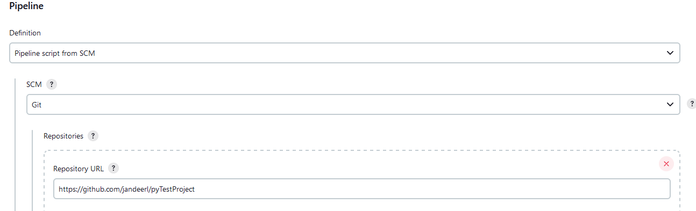
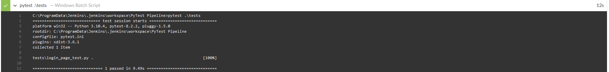

# Selenium Project with pyTest

## Page Object Model
The project is based on POM (Page Object Model), `BasePage` is the base class all page objects inherit from. It includes driver initialization and methods enabling finding elements on page.
```python
#base_page.py

class BasePage:

    def __init__(self, driver):
        self.driver = driver

    def openPage(self, url):
        self.driver.get(url)

    def find_element(self, *locator):
        return self.driver.find_element(*locator)

    def find_elements(self, *locator):
        return self.driver.find_elements(*locator)
```

### Locators

Locators for the elements of the page are put in their own class in `locators.py`, separating each page into their own class.
```python
#locators.py
class MainPageLocators(object):
    MENU_BUTTON = (By.ID, "menu")
    MAIN_LOGO = (By.CLASS_NAME, "app_logo")


class LoginPageLocators(object):
    USERNAME_INPUT = (By.ID, "user-name")
    PASSWORD_INPUT = (By.ID, "password")
    LOGIN_BUTTON = (By.ID, "login-button")
    TITLE_TEXT = (By.CLASS_NAME, "login_logo")
```
### Chaining methods
Each method inside the page object returns the page that should be displayed after the method is called. This allows to chain multiple actions without referencing the page each time.
```python
#login_page.py
    def login_user(self, username, password):
        self.input_username(username).input_password(
            password).click_login_button()
        return MainPage(self.driver)
```

## Tests
Tests are based on pyTest, with `base_test.py` containing the fixture that sets up the WebDriver.
```python
#base_test.py

@pytest.fixture
def driver():
    driver = webdriver.Firefox()

    yield driver

    driver.close()
```
Login test uses the provided driver, creates an instance of the page object, and uses chaining of methods to assert the result.
```python
#login_page_test.py

def test_login_correct_password(driver):
    login_page = LoginPage(driver)
    login_page.openPage(login_page.loginPageUrl)
    is_logo_visible = login_page.login_user(
        "standard_user", "secret_sauce").check_if_logo_visible()
    assert is_logo_visible
```

## Jenkins
The project is connected to a local instance of Jenkins, it is set up to run the tests in `tests` folder using pyTest.
```groovy
//Jenkinsfile
pipeline {
    agent any

    stages {
        stage('Build') {
            steps {
                echo 'Checking Python Version'
                bat 'python --version'
            }
        }
        stage('Test') {
            steps {
                echo 'Testing'
                bat 'pytest .\\tests'
            }
        }
    }
}
```

